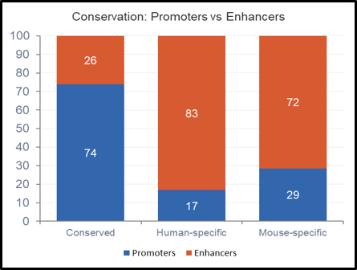

# Task 4: Enhancer and Promoter Classification

## Goal

Classify open chromatin regions (ATAC-seq peaks) as **promoters** or **enhancers** and compare their cross-species conservation between human and mouse adrenal gland.

## Method

Peaks were classified based on distance to Transcription Start Sites (TSS):

- **Promoter**: peak overlaps a +/-2kb window around any TSS
- **Enhancer**: peak does not overlap any TSS window

TSS positions were extracted from GENCODE gene annotations:

- Human: GENCODE v45 (hg38)
- Mouse: GENCODE vM25 (mm10)

Classification was performed using `bedtools intersect`:

- `-u` flag: peaks overlapping a TSS window (promoters)
- `-v` flag: peaks not overlapping any TSS window (enhancers)

## Output Files

All outputs are stored at `/ocean/projects/bio230007p/mkarne/task4/` on Bridges-2.

### Peak Classification (all peaks)

| File | Description | Count | Coordinates |
|------|-------------|-------|-------------|
| `humanpromoters.bed` | Human promoters | 65,958 | Human (hg38) |
| `humanenhancers.bed` | Human enhancers | 140,807 | Human (hg38) |
| `mouse_promoters.bed` | Mouse promoters | 25,790 | Mouse (mm10) |
| `mouse_enhancers.bed` | Mouse enhancers | 22,473 | Mouse (mm10) |

### Conservation Comparison (human coordinates)

| File | Description | Count | Coordinates |
|------|-------------|-------|-------------|
| `conserved_promoters_hg38.bed` | Conserved promoters | 25,773 | Human (hg38) |
| `conserved_enhancers_hg38.bed` | Conserved enhancers | 9,548 | Human (hg38) |
| `human_specific_promoters_hg38.bed` | Human-specific promoters | 11,462 | Human (hg38) |
| `human_specific_enhancers_hg38.bed` | Human-specific enhancers | 52,293 | Human (hg38) |

### Conservation Comparison (mouse coordinates)

| File | Description | Count | Coordinates |
|------|-------------|-------|-------------|
| `mouse_conserved_promoters.bed` | Conserved promoters | 20,003 | Mouse (mm10) |
| `mouse_conserved_enhancers.bed` | Conserved enhancers | 7,964 | Mouse (mm10) |
| `mousespecific_promoters.bed` | Mouse-specific promoters | 5,787 | Mouse (mm10) |
| `mousespecific_enhancers.bed` | Mouse-specific enhancers | 14,509 | Mouse (mm10) |

## Scripts

- `extract_tss.sh` -- Extracts TSS positions from GENCODE GTF files and creates +/-2kb windows
- `classifyingpeaks.sh` -- Classifies peaks as promoters or enhancers using bedtools intersect

## Results

### Peak Classification

| Species | Promoters | Enhancers | % Promoters | % Enhancers |
|---------|-----------|-----------|-------------|-------------|
| Human | 65,958 | 140,807 | 31.9% | 68.1% |
| Mouse | 25,790 | 22,473 | 53.4% | 46.6% |

### Conservation Comparison

| Category | Promoters | Enhancers | % Promoters | % Enhancers |
|----------|-----------|-----------|-------------|-------------|
| Conserved (hg38) | 25,773 | 9,548 | 73.0% | 27.0% |
| Conserved (mm10) | 20,003 | 7,964 | 71.5% | 28.5% |
| Human-specific (hg38) | 11,462 | 52,293 | 18.0% | 82.0% |
| Mouse-specific (mm10) | 5,787 | 14,509 | 28.5% | 71.5% |

### Key Finding

Conserved peaks between human and mouse are predominantly promoters (~73% from human side, ~72% from mouse side), while species-specific peaks are predominantly enhancers (~82% for human-specific, ~71% for mouse-specific). This is consistent with the known biology that promoters are more evolutionarily conserved than enhancers, as promoters are located at gene starts which are shared between species, while enhancers regulate genes from a distance and evolve faster.

## Figures

*Grouped bar chart showing the number of promoters and enhancers in human and mouse adrenal gland ATAC-seq peaks.*

*Stacked bar chart showing the proportion of promoters vs enhancers across conserved, human-specific, and mouse-specific peak categories.*
